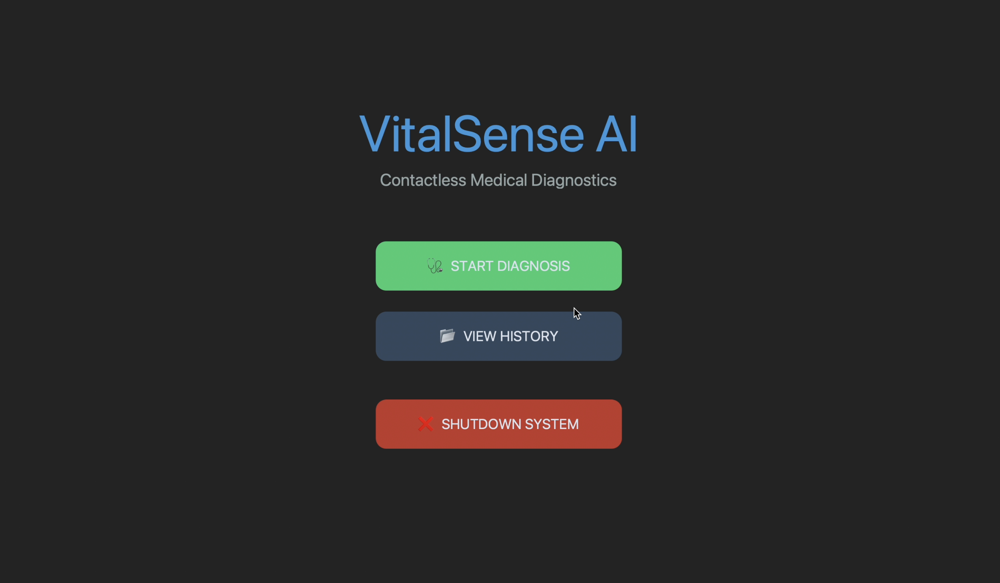
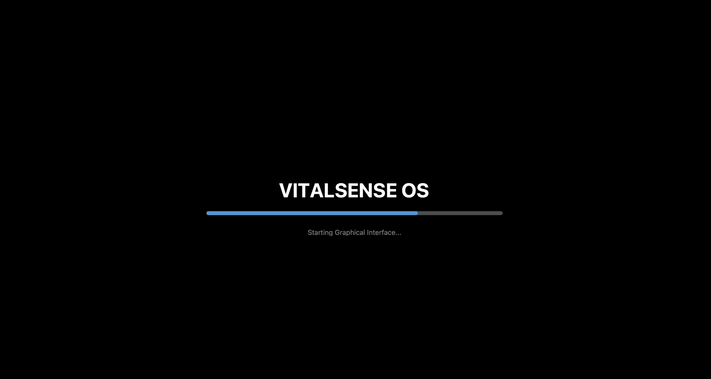
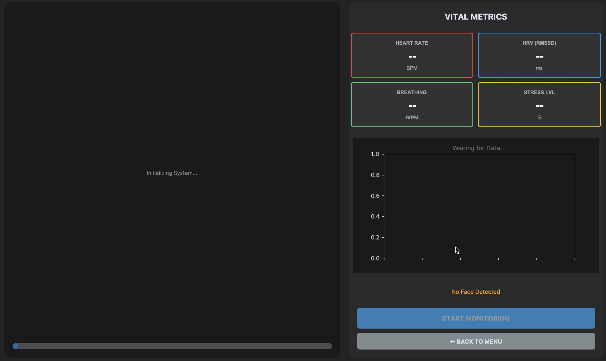
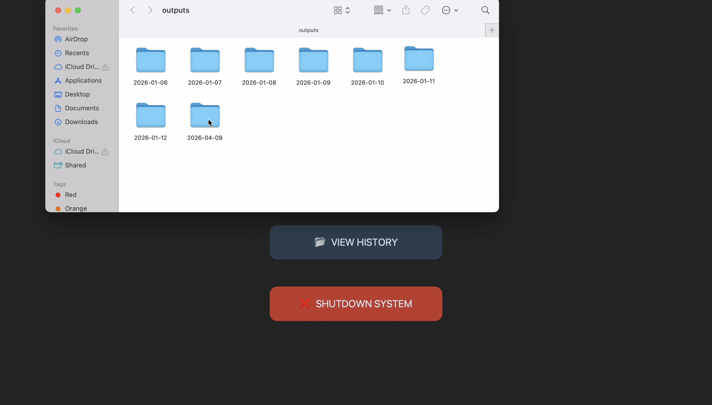
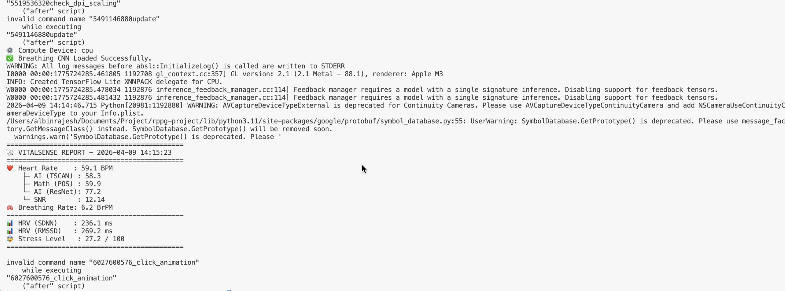

# VitalSense

## Real-Time Camera-Based Vital Signs Monitoring System

VitalSense is a real-time, non-invasive vital signs monitoring system that uses computer vision, remote photoplethysmography (rPPG), deep learning, and machine learning to estimate physiological parameters from facial video captured using a standard webcam.

The system is designed to operate efficiently on relatively low-compute devices while maintaining controlled CPU and RAM usage.

VitalSense currently provides estimates for:

- Heart Rate
- Breathing Rate
- Heart Rate Variability (HRV)
- Stress Level

---

## Overview

VitalSense processes facial video to extract subtle physiological signals associated with changes in blood volume.

The system detects and tracks the user's face, extracts a region of interest (ROI), and analyzes changes in facial skin color caused by blood circulation. These signals are then processed using a combination of deep-learning models, signal-processing algorithms, and machine-learning models.

VitalSense supports:

- Real-time webcam monitoring
- Pre-recorded video processing
- Graphical user interface
- Automated report generation
- Physiological signal visualization

At the end of a monitoring session, the system generates structured JSON data, human-readable reports, and waveform visualizations.

---

## Features

### Graphical User Interface

VitalSense includes a graphical user interface for interacting with the monitoring system and viewing processed data.

The current GUI implementation provides the initial interface for:

- Application initialization
- Hardware initialization
- Monitoring
- Data visualization
- Application status
- Output inspection

### Real-Time Monitoring

Captures and processes video frames from a webcam or pre-recorded video.

### Heart Rate Estimation

VitalSense uses three complementary approaches for heart-rate estimation:

- **TSCAN** — Deep-learning-based rPPG signal extraction
- **POS (Plane Orthogonal to Skin)** — Mathematical rPPG signal extraction
- **HR-ResNet** — Deep-learning-based heart-rate estimation

The resulting estimates are compared using a consensus mechanism to obtain the final heart-rate estimate.

### Breathing Rate Detection

A trained **XGBoost model** is used to estimate breathing rate from physiological and HRV-related features.

A heuristic fallback method is available when the trained model cannot be used.

### Stress Level Analysis

A trained **LightGBM model** estimates stress levels on a 0–100 scale using multiple physiological features.

### Heart Rate Variability Analysis

VitalSense calculates several HRV-related metrics, including:

- SDNN
- RMSSD
- pNN50
- LF/HF ratio

### Automated Reports

The system generates:

- JSON data
- Human-readable text reports
- Pulse waveform visualizations
- Frequency-spectrum analysis

### Resource-Efficient Processing

The processing pipeline uses configurable capture and batch-processing parameters to control CPU and memory usage, making the system suitable for relatively low-compute environments.

---

## User Interface

The current GUI implementation contains several stages and views.

### Main Menu



### Loading Screen



### Hardware Initialization



### Data View


### Output Folder Structure

VitalSense organizes generated reports and analysis results by date and monitoring session.



### Completed Processing



---

## How It Works

The VitalSense processing pipeline consists of several stages:

```text
                 Webcam / Video
                       |
                       v
             +---------------------+
             | Face Detection &    |
             | Landmark Tracking   |
             +----------+----------+
                        |
                        v
             +---------------------+
             |   ROI Extraction    |
             |     (Forehead)      |
             +----------+----------+
                        |
                        v
             +---------------------+
             |   rPPG Extraction   |
             |    TSCAN + POS      |
             +----------+----------+
                        |
                        v
             +---------------------+
             | Heart Rate Analysis |
             |  TSCAN / POS / ResNet
             +----------+----------+
                        |
               +--------+--------+
               |                 |
               v                 v
      +------------------+ +------------------+
      |  Breathing Rate  | |   Stress Level   |
      |     XGBoost      | |     LightGBM     |
      +---------+--------+ +--------+---------+
                |                 |
                +--------+--------+
                         |
                         v
               +---------------------+
               |  Report Generation  |
               | JSON / TXT / Graphs |
               +---------------------+
```

### 1. Video Capture and Face Detection

VitalSense captures frames from either a webcam or a pre-recorded video.

**MediaPipe FaceMesh** is used to:

- Detect the face
- Track facial landmarks
- Identify the forehead region
- Extract the region of interest used for rPPG analysis

### 2. rPPG Signal Extraction

The extracted facial ROI contains subtle variations in skin color associated with changes in blood volume.

VitalSense uses two approaches for rPPG signal extraction:

- **TSCAN** for deep-learning-based PPG signal extraction
- **POS** for mathematical rPPG signal extraction

TSCAN processes RGB facial frames in batches and uses temporal modeling to capture physiological changes over time.

### 3. Heart Rate Estimation

Three approaches are used to estimate heart rate:

| Method | Approach |
|---|---|
| TSCAN | Deep-learning-based PPG extraction |
| POS | Mathematical RGB signal processing |
| HR-ResNet | Deep-learning-based heart-rate estimation |

The system compares the resulting estimates and uses a consensus mechanism to determine the final heart-rate estimate.

### 4. Breathing Rate Detection

The breathing-rate model uses physiological and HRV-related features including:

- Heart rate
- SDNN
- RMSSD

These features are passed to a trained **XGBoost model**.

If the trained model cannot be used, VitalSense falls back to a heuristic estimation method.

### 5. Stress Level Analysis

A trained **LightGBM model** analyzes multiple physiological features:

- Heart rate
- SDNN
- RMSSD
- pNN50
- LF/HF ratio
- Breathing rate

The resulting stress estimate is represented on a 0–100 scale.

### 6. Report Generation

After processing is complete, VitalSense generates:

- Structured JSON data
- Human-readable text reports
- Pulse waveform visualizations
- Frequency-spectrum analysis

---

## Technology Stack

### Core Technologies

| Technology | Purpose |
|---|---|
| Python 3.8+ | Core programming language |
| OpenCV | Video capture and image processing |
| MediaPipe | Face detection and facial landmark tracking |
| PyTorch | Deep-learning model training and inference |
| NumPy | Numerical processing |
| SciPy | Signal processing |
| Matplotlib | Data visualization |

### Machine Learning Models

| Model | Purpose |
|---|---|
| TSCAN | rPPG / PPG signal extraction |
| HR-ResNet | Heart-rate estimation |
| XGBoost | Breathing-rate prediction |
| LightGBM | Stress-level estimation |
| Resp-PPG Model | Physiological signal processing |

The **TSCAN and HR-ResNet models were trained by the project author specifically for VitalSense**.

---

## Project Structure

```text
vitalsense/
│
├── models/
│
├── outputs/
│   └── YYYY-MM-DD/
│       └── HH-MM-SS/
│           ├── vital_data.json
│           ├── report.txt
│           └── waveform_analysis.png
│
├── screenshots/
│   ├── Data_View.png
│   ├── Initialisation_Hardware.png
│   ├── OutPut_Folder_Tree.png
│   ├── Main_menu.png
│   ├── Loading_Screen.png
│   └── Completed_Terminal_output.png
│
├── LICENSE
├── README.md
├── requirements.txt
│
├── breathing_model.json
├── config.py
├── gui_app.py
├── hr_resnet_denoise.pth
├── inspect_model.py
├── launcher.py
├── main.py
├── models_definitions.py
├── models_loading.py
├── resp_ppg_model2.pt
├── signal_processing.py
├── stress_model-2.txt
├── tscan_Official_best_EPO60.pth
└── vital_monitor.py
```

### Main Components

| File | Description |
|---|---|
| `main.py` | Main application entry point |
| `launcher.py` | Application launching component |
| `gui_app.py` | Graphical user interface |
| `vital_monitor.py` | Core vital-sign monitoring logic |
| `config.py` | Configuration settings and constants |
| `models_definitions.py` | Neural network architectures |
| `models_loading.py` | Model loading utilities |
| `signal_processing.py` | Signal-processing utilities |
| `inspect_model.py` | Model inspection utility |
| `requirements.txt` | Python dependencies |

---

## System Requirements

### Minimum Requirements

| Component | Requirement |
|---|---|
| CPU | Intel Core i5 or equivalent |
| RAM | 8 GB |
| Storage | 2 GB free space |
| Webcam | 720p |
| Python | 3.8+ |

### Recommended Requirements

| Component | Requirement |
|---|---|
| CPU | Intel Core i7 or equivalent |
| RAM | 16 GB |
| GPU | NVIDIA GPU with 4 GB+ VRAM |
| Webcam | 1080p |
| Storage | SSD |

GPU acceleration is optional. VitalSense can fall back to CPU processing when a compatible GPU is unavailable.

---

## Installation

### Prerequisites

Before installing VitalSense, make sure you have:

- Python 3.8 or newer
- pip
- A compatible webcam for real-time monitoring

### Clone the Repository

```bash
git clone https://github.com/yourusername/vitalsense.git
cd vitalsense
```

Replace `yourusername/vitalsense` with the actual repository URL.

### Automatic Setup

Run:

```bash
python main.py
```

The application will automatically:

1. Create a virtual environment
2. Install the required dependencies
3. Launch the monitoring system

### Manual Installation

If you prefer to configure the environment manually:

#### Create a Virtual Environment

```bash
python -m venv venv
```

#### Activate the Environment

**Windows:**

```bash
venv\Scripts\activate
```

**macOS / Linux:**

```bash
source venv/bin/activate
```

#### Install Dependencies

```bash
pip install -r requirements.txt
```

---

## Model Setup

VitalSense uses several trained models for physiological signal extraction and analysis.

The project currently contains the following model files:

```text
tscan_Official_best_EPO60.pth
hr_resnet_denoise.pth
resp_ppg_model2.pt
breathing_model.json
stress_model-2.txt
```

### TSCAN and HR-ResNet

The **TSCAN and HR-ResNet models were trained by the project author specifically for this project**.

Their implementation is used within the VitalSense processing pipeline for rPPG signal extraction and heart-rate estimation.

The underlying methodologies and model architectures are based on research in remote photoplethysmography and physiological signal processing. Appropriate attribution should be given to the original research upon which these methods are based.

### Model Availability

If a required model file is unavailable or cannot be loaded, the corresponding component may fall back to an alternative estimation method or initialization depending on the implementation.

Using the trained models is strongly recommended for meaningful results.

---

## Usage

### Webcam Monitoring

To start monitoring using the default webcam:

```bash
python main.py
```

### Video File Processing

To process a pre-recorded video:

```bash
python main.py -f path/to/video.mp4
```

### Graphical Interface

VitalSense includes an initial graphical interface implemented through:

```text
gui_app.py
launcher.py
```

The GUI provides an interface for interacting with the monitoring pipeline and viewing application status and processed data.

---

## Configuration

VitalSense can be configured through `config.py`.

Example parameters:

```python
CAPTURE_FRAMES = 900      # Number of frames to capture
BATCH_SIZE = 300          # Batch size for model processing
FS_TARGET = 30.0          # Target sampling rate in FPS
```

For example, at 30 FPS:

```text
900 frames / 30 FPS = 30 seconds
```

Reducing `CAPTURE_FRAMES` can reduce processing time and memory usage.

---

## Output

VitalSense stores generated results inside the `outputs/` directory.

The output structure is organized by date and monitoring session:

```text
outputs/
└── YYYY-MM-DD/
    └── HH-MM-SS/
        ├── vital_data.json
        ├── report.txt
        └── waveform_analysis.png
```

### JSON Output

Example:

```json
{
  "timestamp": 1641234567.89,
  "heart_rate": 72.5,
  "breathing_rate": 15.2,
  "hrv_sdnn": 42.3,
  "hrv_rmssd": 28.7,
  "stress_level": 35.6,
  "components": {
    "tscan": 71.8,
    "pos": 73.2,
    "resnet": 72.1
  }
}
```

### Human-Readable Report

Example:

```text
=============================================
VITALSENSE REPORT - YYYY-MM-DD HH:MM:SS
=============================================
Heart Rate     : 72.5 BPM
    TSCAN      : 71.8
    POS        : 73.2
    ResNet     : 72.1
Breathing Rate : 15.2 BrPM
---------------------------------------------
HRV (SDNN)     : 42.3 ms
HRV (RMSSD)    : 28.7 ms
Stress Level   : 35.6 / 100
=============================================
```

---

## Troubleshooting

### No Face Detected

Try the following:

- Ensure adequate lighting
- Position your face directly in front of the camera
- Avoid extreme camera angles
- Keep your face within the camera frame

### Model Loading Errors

Check that:

- All required model files are present
- Model filenames match the paths expected by the configuration
- The application has permission to read the model files

### CUDA Errors

If GPU acceleration is enabled:

- Verify that CUDA is correctly installed
- Verify that your PyTorch installation supports your CUDA version

VitalSense can fall back to CPU processing when a compatible GPU is unavailable.

### Low FPS or Buffer Issues

Try:

- Reducing `CAPTURE_FRAMES` in `config.py`
- Using a shorter recording duration
- Reducing the processing batch size
- Closing other resource-intensive applications

---

## Performance

### Processing Pipeline

Approximate processing times:

| Stage | Processing Time |
|---|---:|
| Face Detection | ~20 ms / frame |
| ROI Extraction | ~5 ms / frame |
| TSCAN Inference | ~100 ms / batch |
| Total Processing | ~3–5 seconds / 900 frames |

### Accuracy

Reported performance on validation datasets:

| Measurement | Performance |
|---|---:|
| Heart Rate | ±3 BPM (95% confidence) |
| Breathing Rate | ±1.5 BrPM |
| Stress Level | 85% classification accuracy |

> Performance and accuracy may vary depending on lighting conditions, camera quality, subject movement, hardware, and dataset characteristics.

---

## Research Areas

VitalSense combines techniques from several research areas:

- Remote Photoplethysmography (rPPG)
- Video-Based Vital Sign Monitoring
- Computer Vision
- Deep Learning
- Physiological Signal Processing
- Machine Learning

---

## Research and Attribution

VitalSense builds upon research and techniques developed in the areas of remote photoplethysmography, video-based physiological monitoring, deep-learning-based physiological signal extraction, and heart-rate estimation.

The project uses methodologies and concepts derived from existing academic research and open-source software.

The **TSCAN and HR-ResNet models used by VitalSense were trained by the project author specifically for this project**. However, the underlying architectures and methodologies are based on prior research.

Relevant research papers and original projects should be credited when redistributing, extending, or publishing work based on these components.

Third-party libraries used by VitalSense retain their respective licenses and terms of use.

---

## Disclaimer

VitalSense is a **research and software-development project** intended for experimentation, development, and demonstration of camera-based physiological signal processing.

The measurements produced by the system should **not be considered a substitute for medical-grade monitoring equipment, clinical measurements, or professional medical advice**.

Environmental conditions, camera characteristics, subject movement, lighting, and other factors may affect the accuracy of the measurements.

---

## License

VitalSense is released under the **MIT License**.

Copyright (c) 2026 Albin Rajesh

See the [`LICENSE`](LICENSE) file for the complete license text.

The MIT License applies to the original VitalSense source code and other original project material created by the project author, unless otherwise stated.

Third-party libraries, research implementations, model architectures, datasets, and external components remain subject to their respective licenses and terms of use.

---

## Acknowledgments

This project would not be possible without the research and open-source ecosystem surrounding:

- Remote Photoplethysmography
- Computer Vision
- Physiological Signal Processing
- Deep Learning
- Heart-Rate Estimation
- Machine Learning

